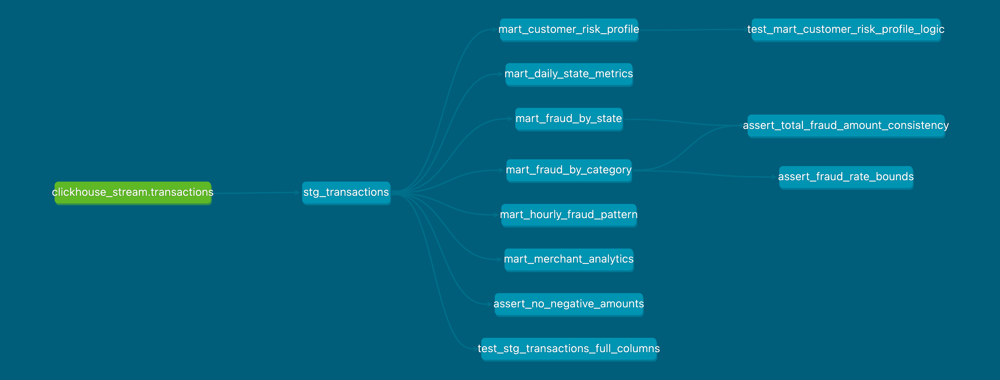
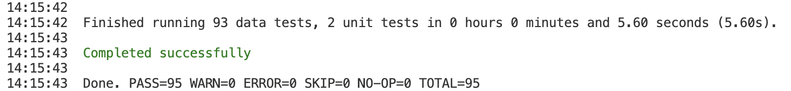

# Fraud Detection dbt Project

by Nikita Artamonov

This dbt project is designed to build a robust data transformation pipeline for analyzing transactional data to detect fraud patterns. The project leverages **ClickHouse** as the data warehouse and utilizes such tools as **SQLFluff** for SQL linting and **pre-commit** for maintaining code quality.

## Project Overview

The primary goal of this project is to transform raw transaction data into a set of analytical data marts. These marts provide the following information:
*   Daily transaction trends by state.
*   Fraud levels across different transaction categories and states.
*   Customer risk profiles.
*   Temporal fraud patterns (hourly/daily).
*   Merchant performance and suspicious activity.

The project emphasizes a layered data architecture (`raw` → `staging` → `marts`), testing, and automated code quality checks.

## Repository Structure

```
dbt_fraud_detection/
├── README.md
├── Makefile                  # Automation for common dbt and development tasks
├── dbt_project.yml           # dbt project configuration
├── packages.yml              # dbt external packages (dbt_utils, dbt_expectations)
├── profiles.yml              # ClickHouse connection profile
├── .gitignore
├── .sqlfluff                 # SQLFluff configuration for linting SQL
├── .pre-commit-config.yaml   # Pre-commit hooks configuration
├── macros/
│   └── amount_bucket.sql     # Custom macro for amount segmentation
├── models/
│   ├── unit_tests.yml        # Unit tests for staging models and marts
│   ├── sources/
│   │   └── sources.yml       # Defines the raw data source
│   ├── staging/
│   │   ├── stg_transactions.sql
│   │   ├── stg_transactions.yml # Schema & tests for staging model
│   └── marts/
│       ├── mart_daily_state_metrics.sql
│       ├── mart_fraud_by_category.sql
│       ├── mart_fraud_by_state.sql
│       ├── mart_customer_risk_profile.sql
│       ├── mart_hourly_fraud_pattern.sql
│       ├── mart_merchant_analytics.sql
│       └── schema.yml         # Schema & tests for mart models
├── tests/                     # Singular tests
│   ├── assert_fraud_rate_bounds.sql
│   ├── assert_no_negative_amounts.sql
│   └── assert_total_fraud_amount_consistency.sql
└── demo_data/
    ├── dbt-dag.png          # DAG visualization
    ├── test_results.png     # Test results screenshot
    └── test_results.log     # Test results log

```

## Data Source

The project relies on a single raw data source in ClickHouse:

*   **Database**: `default`
*   **Table**: `transactions`

This table contains detailed transaction records with a `target` column indicating whether a transaction is fraudulent (`1`) or legitimate (`0`).

| Column            | Type       | Description                                  |
| :---------------- | :--------- | :------------------------------------------- |
| `transaction_time`| `DateTime` | Timestamp of the transaction.                |
| `merch`           | `String`   | Name of the merchant.                        |
| `cat_id`          | `String`   | Category of the transaction (e.g., 'food_dining'). |
| `amount`          | `Float64`  | Transaction amount in USD.                   |
| `name_1`, `name_2`| `String`   | First and last name of the customer.         |
| `gender`          | `String`   | Customer's gender ('M'/'F').                 |
| `jobs`            | `String`   | Customer's profession.                       |
| `us_state`        | `String`   | US state or federal district (e.g., 'CA', 'TX'). |
| `one_city`        | `String`   | Customer's city.                             |
| `street`          | `String`   | Customer's street address.                   |
| `post_code`       | `Int64`    | Customer's postal code.                      |
| `lat`, `lon`      | `Float64`  | Customer's latitude and longitude.           |
| `merchant_lat`, `merchant_lon` | `Float64` | Merchant's latitude and longitude.       |
| `population_city` | `Int64`    | Population of the customer's city.           |
| `target`          | `Int64`    | **Fraud flag**: `1` for fraud, `0` for legitimate. |

## Data Marts

The project generates the following analytical data marts:

1.  **`mart_daily_state_metrics`**:
    *   Aggregated daily transaction metrics by US state.

2.  **`mart_fraud_by_category`**:
    *   Aggregated fraud statistics by spending category.

3.  **`mart_fraud_by_state`**:
    *   Geographical distribution of fraud across US states.

4.  **`mart_customer_risk_profile`**:
    *   Profiles individual customers based on their transaction history and fraud involvement. Customers are segmented into `HIGH`, `MEDIUM`, or `LOW` risk levels.

5.  **`mart_hourly_fraud_pattern`**:
    *   Temporal analysis of fraud patterns by day of the week and hour of the day. Identifies specific time windows with elevated fraud risk.

6.  **`mart_merchant_analytics`**:
    *   Tracks merchant metrics. Labels merchants as `suspicious` if their fraud amount exceeds a certain threshold.

## DAG Visualization



## Tests

### Generic Tests (in `models/staging/stg_transactions.yml` and `models/marts/schema.yml`)
*   `unique`, `not_null`, `accepted_values`
*   `dbt_utils.expression_is_true`
*   `dbt_utils.unique_combination_of_columns`
*   `dbt_expectations.expect_column_values_to_be_between`
*   `dbt_expectations.expect_column_values_to_be_in_set`

### Singular Tests (in `tests/` directory)
*   **`assert_no_negative_amounts.sql`**: Ensures that transaction `amount` is never negative in `stg_transactions`.
*   **`assert_fraud_rate_bounds.sql`**: Checks that `fraud_rate_pct` values in `mart_fraud_by_category` are always between 0 and 100.
*   **`assert_total_fraud_amount_consistency.sql`**: Ensures that the total sum of `fraud_amount` is consistent across `mart_fraud_by_state` and `mart_fraud_by_category`.

### Unit Tests (in `models/unit_tests.yml`)
*   **`test_stg_transactions_full_columns`**: Verifies the `stg_transactions` model's transformations, including surrogate key generation (with an `overrides` mock), column renaming and the `get_amount_bucket` macro logic, using mocked raw data.
*   **`test_mart_customer_risk_profile_logic`**: Tests the `mart_customer_risk_profile` model's segmentation logic (`HIGH`/`MEDIUM`/`LOW` risk levels) with specific customer scenarios.

## Test Results

Test results can be found in the [`demo_data/test_results.log`](demo_data/test_results.log) log file. A screenshot of the test results is provided below:



## Custom Macros

*   **`get_amount_bucket(column_name)`**:
    *   **Source**: [`macros/amount_bucket.sql`](macros/amount_bucket.sql)
    *   **Purpose**: Takes a numeric column (transaction amount) and segments it into categorical buckets based on quantile thresholds.
    *   **Logic**:
        *   `<= 10`: **'Small'**
        *   `> 10` and `<= 47`: **'Medium-Small'**
        *   `> 47` and `<= 83`: **'Medium-Large'**
        *   `> 83`: **'Large'**
    *   **Usage**: Applied in `stg_transactions` to create the `amount_segment` column.

## Development Tools

### SQLFluff
*   **Configuration**: The `.sqlfluff` file in the project root configures rules for the `ClickHouse` dialect and dbt templating.
*   **Usage**: Integrated with `pre-commit` and callable via `make lint_models` and `make lint_tests`.

### .pre-commit-config.yaml
*   **Hooks Included**:
    *   General file checks (YAML syntax, trailing whitespace, end-of-file newlines, merge conflicts).
    *   `sqlfluff-lint`: Runs SQLFluff on staged SQL files.
*   **Setup**: Run `pre-commit install` once after cloning the repo.

### Makefile
*   **Commands**:
    *   `make deps`: Install dbt package dependencies.
    *   `make seed`: Load CSV data.
    *   `make run`: Run all dbt models.
    *   `make test`: Run all dbt tests (generic, singular, unit).
    *   `make test_save`: Run all tests and saves the results to `demo_data/test_results.log`.
    *   `make docs`: Generate and serve dbt documentation. Access at `http://localhost:8001`.
    *   `make lint_models`: Run `sqlfluff` linting on models.
    *   `make lint_tests`: Run `sqlfluff` linting on tests.
    *   `make all`: Install dependencies, run models, tests, and generate docs in one command.

## How to Launch the Project

Follow these steps to set up and run the dbt project:

### 1. Prerequisites

*   **dbt-core 1.11.2**
*   **dbt-clickhouse 1.9.7**
*   **sqlfluff 3.5.0**
*   **pre-commit 4.5.1**

### 2. Set Up ClickHouse

Clone the [ClickHouse Kafka Practice](https://github.com/prNickinv/clickhouse_kafka_practice/) repository and follow the instructions in its ``README.md`` to set up ``ClickHouse`` and ingest the data from the [Kaggle Competition](https://www.kaggle.com/competitions/teta-ml-1-2025/data?select=train.csv).


### 3. Clone the Repository

```bash
git clone https://github.com/prNickinv/dbt_fraud_detection.git
cd dbt_fraud_detection
```

### 4. Install Pre-Commit Hooks

```bash
pre-commit install
```

### 5. Run the dbt Project

Use the `Makefile` commands:

*   **Install dependencies, run models, tests, and generate docs**:
    ```bash
    make all
    ```

*   **Run tests and save results to a file**:
    ```bash
    make test_save
    ```

*   **Manually lint SQL models and tests**:
    ```bash
    make lint_models
    make lint_tests
    ```
